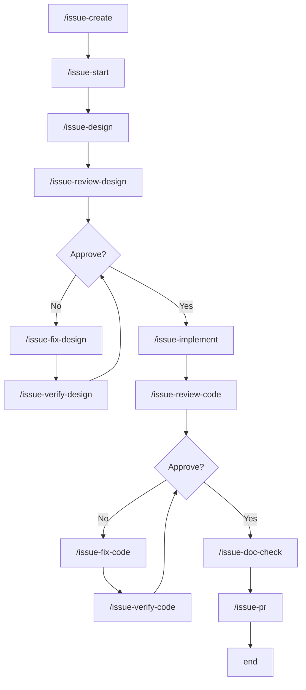
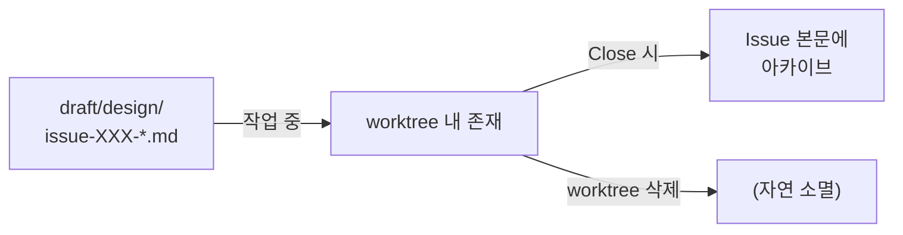

# Development Workflow

AI 기반 개발 워크플로우. Issue 생성부터 완료까지 일관된 흐름으로 작업을 진행한다.

## 전체 플로우



## 페이즈 개요

| 페이즈 | 명령어 | 산출물 |
|----------|----------|--------|
| 1. 기표 | `/issue-create` | GitHub Issue + 라벨 |
| 2. 착수 | `/issue-start` | worktree + Issue 본문에 메타 정보 |
| 3. 설계 | `/issue-design` | `draft/design/`에 설계서 |
| 4. 구현 | `/issue-implement` | 코드 + 테스트 |
| 5. PR 생성 | `/issue-pr` | PR 생성 |
| 6. 완료 | `/issue-close` | 설계서 아카이브 + PR 머지 + worktree 삭제 (※수동 실행) |

## 상세 플로우

```
┌─────────────────────────────────────────────────────────────────────┐
│ Phase 1: 기표                                                       │
│ /issue-create "타이틀" [type]                                       │
├─────────────────────────────────────────────────────────────────────┤
│ • Issue 생성                                                        │
│ • 라벨 부여 (type:feature / type:bug / type:refactor 등)            │
│ • Issue 번호를 반환                                                  │
└─────────────────────────────────────────────────────────────────────┘
                                  ↓
┌─────────────────────────────────────────────────────────────────────┐
│ Phase 2: 착수                                                       │
│ /issue-start <issue-number> [prefix]                                │
├─────────────────────────────────────────────────────────────────────┤
│ • prefix 미지정 시 feat를 기본 사용                                 │
│ • worktree 생성: ../kuku-[prefix]-[issue-number]                     │
│ • .venv 심볼릭 링크 생성                                            │
│ • Issue 본문에 Worktree 정보 추가 기재                              │
└─────────────────────────────────────────────────────────────────────┘
                                  ↓
┌─────────────────────────────────────────────────────────────────────┐
│ Phase 3: 설계                                                       │
│ /issue-design <issue-number>                                        │
├─────────────────────────────────────────────────────────────────────┤
│ • Issue 본문에서 Worktree 정보 취득 → 작업                          │
│ • draft/design/issue-[number]-xxx.md 생성                           │
│ • 커밋                                                              │
│ • Issue에 설계 완료 코멘트                                          │
│                                                                     │
│ ┌─────────────────────────────────────────────────────────────────┐ │
│ │ 리뷰 사이클                                                     │ │
│ │ /issue-review-design → /issue-fix-design → /issue-verify-design │ │
│ │                              ↑                    │              │ │
│ │                              └── Changes ─────────┘              │ │
│ │                                     ↓ Approve                    │ │
│ └─────────────────────────────────────────────────────────────────┘ │
└─────────────────────────────────────────────────────────────────────┘
                                  ↓
┌─────────────────────────────────────────────────────────────────────┐
│ Phase 4: 구현                                                       │
│ /issue-implement <issue-number>                                     │
├─────────────────────────────────────────────────────────────────────┤
│ • Issue 본문에서 Worktree 정보 취득 → 작업                          │
│ • draft/design/ 참조                                                │
│ • Baseline Check: pytest 실행 → failure 있으면 Issue 코멘트에 기록   │
│ • TDD: 테스트 작성 (Red) → 구현 (Green) → 리팩터                    │
│ • 품질 체크 (커밋 전 필수):                                         │
│   source .venv/bin/activate                                         │
│   ruff check src/ tests/ && ruff format src/ tests/                 │
│   mypy src/ && pytest                                               │
│ • Issue에 구현 완료 코멘트 (pytest 출력 포함)                        │
│                                                                     │
│ ┌─────────────────────────────────────────────────────────────────┐ │
│ │ 리뷰 사이클                                                     │ │
│ │ /issue-review-code → /issue-fix-code → /issue-verify-code       │ │
│ │                            ↑                  │                  │ │
│ │                            └── Changes ───────┘                  │ │
│ │                                   ↓ Approve                      │ │
│ └─────────────────────────────────────────────────────────────────┘ │
│                                                                     │
│ ┌─────────────────────────────────────────────────────────────────┐ │
│ │ 문서 체크                                                       │ │
│ │ /issue-doc-check                                                 │ │
│ │ • 설계서의 "영향 문서" 섹션 확인                                 │ │
│ │ • 변경에 따른 문서 업데이트 요부 판정·실시                       │ │
│ └─────────────────────────────────────────────────────────────────┘ │
└─────────────────────────────────────────────────────────────────────┘
                                  ↓
┌─────────────────────────────────────────────────────────────────────┐
│ Phase 5: PR 생성                                                    │
│ /issue-pr <issue-number>                                            │
├─────────────────────────────────────────────────────────────────────┤
│ • Issue 본문에서 Worktree 정보 취득                                 │
│ • git absorb (커밋 이력 정리)                                       │
│ • git push                                                          │
│ • gh pr create                                                      │
│ • 여기서 워크플로우 자동 실행 종료                                  │
└─────────────────────────────────────────────────────────────────────┘
                                  ↓
┌─────────────────────────────────────────────────────────────────────┐
│ Phase 6: 완료 (※워크플로우 외. 수동 실행)                           │
│ /issue-close <issue-number>                                         │
├─────────────────────────────────────────────────────────────────────┤
│ • draft/design/ → Issue 본문에 설계서 아카이브 (<details> 태그)     │
│ • gh pr merge --merge --delete-branch                               │
│ • .venv 심볼릭 링크 삭제                                            │
│ • git worktree remove                                               │
│ • 완료 보고                                                         │
└─────────────────────────────────────────────────────────────────────┘
```

## 설계서 규칙

| 규칙 | 설명 |
|--------|------|
| What & Constraint | 입력/출력과 제약만 |
| Minimal How | 구현 상세는 방침만. 의사 코드는 OK |
| Primary Sources | 1차 정보 (공식 문서 등)의 URL/경로를 반드시 기재 |
| API 사양 | 공식 링크 참조 (복사 금지) |
| Test Strategy | ID 나열이 아닌 검증 관점을 언어화 |

## 라벨·type 매핑

| 라벨 | type | 용도 |
|--------|------|------|
| `enhancement` | feat | 신기능 추가 |
| `bug` | fix | 버그 수정 |
| `refactoring` | refactor | 리팩터링 |
| `documentation` | docs | 문서 |
| `good first issue` | test | 테스트 추가·개선 |

## Issue 본문 구조

`/issue-start` 실행 후, Issue 본문 선두에 메타 정보가 추가 기재된다:

```markdown
> [!NOTE]
> **Worktree**: `../kuku-fix-123`
> **Branch**: `fix/123`

(원래 Issue 본문)
```

PR 생성 후:

```markdown
> [!NOTE]
> **Worktree**: `../kuku-fix-123`
> **Branch**: `fix/123`
> **PR**: #456
```

## 설계서 보관 장소



| 페이즈 | 장소 | 설명 |
|----------|------|------|
| 작업 중 | `draft/design/issue-XXX-*.md` | worktree 내, 커밋 대상 |
| Close 시 | Issue 본문에 아카이브 | `<details>` 태그로 접기 |
| 아키텍처 결정 | `docs/adr/` | ADR로서 영속화 (종래대로) |

## 명령어 목록

### 라이프사이클 관리

| 명령어 | 설명 |
|----------|------|
| `/issue-create` | Issue 생성 + 라벨 부여 |
| `/issue-start` | worktree 구축 + Issue 본문에 메타 정보 추가 기재 |
| `/issue-doc-check` | PR 전 문서 영향 체크 |
| `/issue-pr` | 커밋 정리 + PR 생성 |
| `/issue-close` | 설계서 아카이브 + PR 머지 + worktree 삭제 |

### 설계 페이즈

| 명령어 | 설명 |
|----------|------|
| `/issue-design` | draft/design/에 설계서 작성 |
| `/issue-review-design` | 설계 리뷰 |
| `/issue-fix-design` | 설계 수정 |
| `/issue-verify-design` | 설계 재확인 |

### 구현 페이즈

| 명령어 | 설명 |
|----------|------|
| `/issue-implement` | TDD로 구현 |
| `/issue-review-code` | 코드 리뷰 |
| `/issue-fix-code` | 코드 수정 |
| `/issue-verify-code` | 코드 재확인 |
