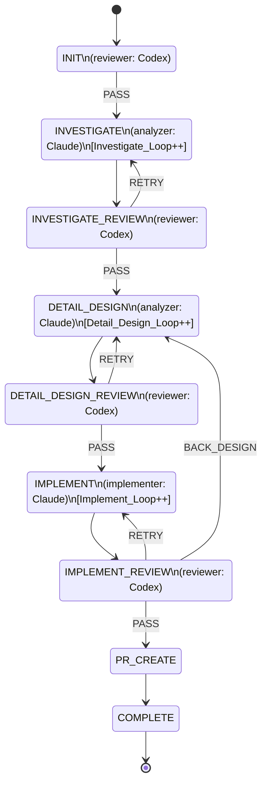
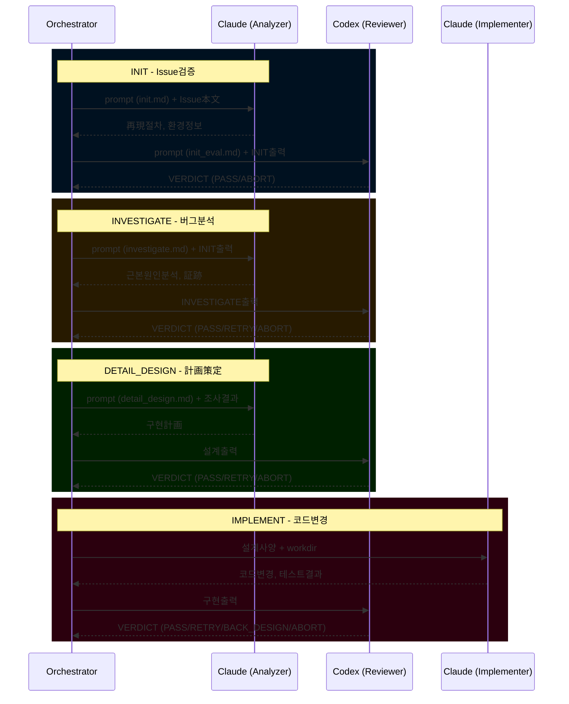
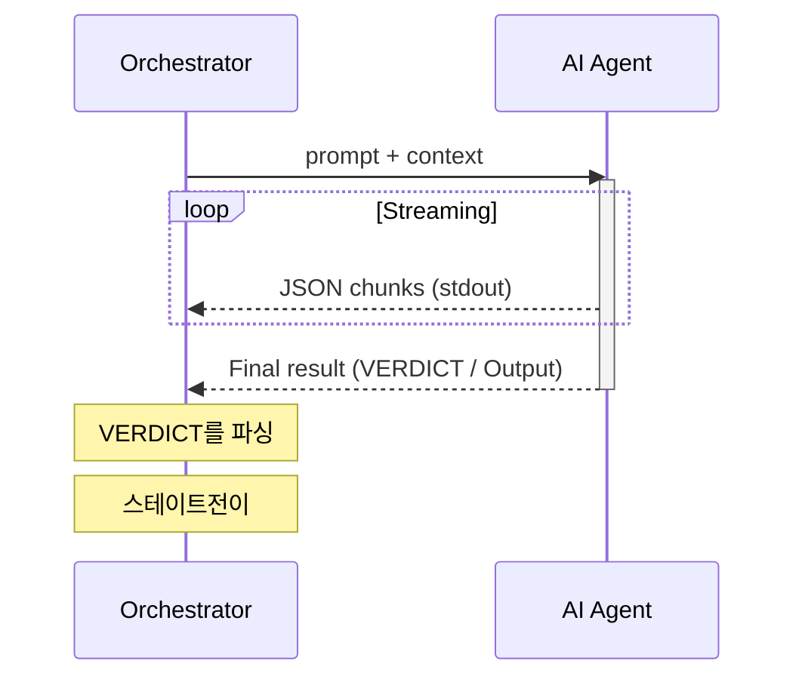
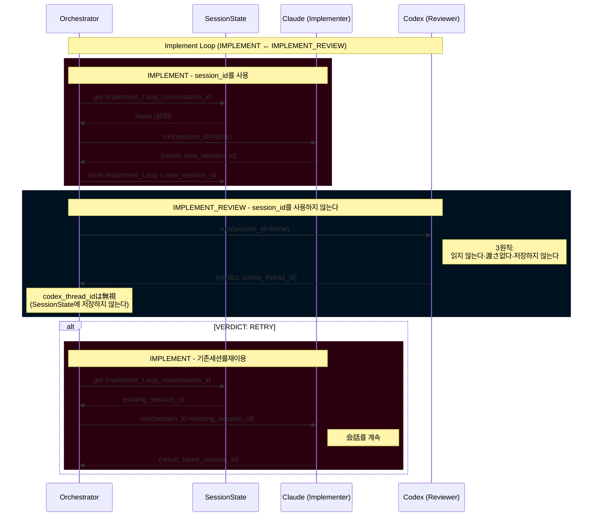
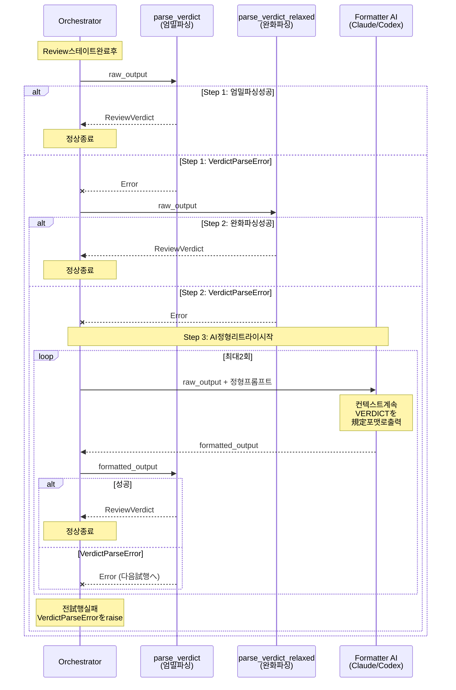

# BugfixAgent v5 아키텍처문서

> Issue #194 프로토콜사양와16회이상의E2E테스트反復를 통합한포괄적인설계문서

**버전**: 2.2.0
**최종업데이트日**: 2025-12-18
**스테이터스**: 개발中
**関連Issue**: [#194](https://github.com/apokamo/kamo2/issues/194), [#312](https://github.com/apokamo/kamo2/issues/312)

---

## 목차

1. [개요](#1-개요)
2. [상태 머신](#2-상태 머신)
3. [출력의표준화 (리뷰결과)](#3-출력의표준화-리뷰결과)
4. [스테이트마다의정의](#4-스테이트마다의정의)
5. [입력의표준화](#5-입력의표준화)
6. [데이터 흐름](#6-데이터 흐름)
7. [공통프롬프트](#7-공통프롬프트)
8. [종료조건](#8-종료조건)
9. [AI도구통합](#9-ai도구통합)
 - [9.5 세션관리](#95-세션관리)
10. [에러ハンドリング와 폴백](#10-에러ハンドリング와 폴백)
11. [아키텍처 결정 기록](#11-아키텍처 결정 기록)
12. [E2E테스트설계](#12-e2e테스트설계)
13. [개발가이드](#13-개발가이드)

---

## 1. 개요

### 1.1 목적

BugfixAgent v5は, AI구동의自律타입버그수정시스템입니다.GitHub Issueを与えられると, 이하의절차를 실행합니다：
1. Issue의검증 (INIT)
2. 버그의조사와再現 (INVESTIGATE)
3. 수정案의 설계 (DETAIL_DESIGN)
4. 수정의구현 (IMPLEMENT)
5. プル리퀘스트의생성 (PR_CREATE)

### 1.2 문제提起

이전의버전로는, 스테이트間의 인터페이스이一貫하여いません로 한：
- P0-1: Codex의출력포맷의不統一 (JSON/텍스트)
- P0-2: 리뷰판정로직의不統一 (`blocker: Yes` vs `BLOCKED`)

근본원인：**상태 머신레벨로의프로토콜정의의欠如**.

### 1.3 설계思想

- **프로토콜ファースト**: 전스테이트로 리뷰결과포맷를統一
- **関心의 분리**: 각AI모델이특정의 역할를 가진다
- **フェイルセーフ설계**: サーキットブレーカー, 리트라이제한, 폴백メカニズム
- **가능観測性**: JSONLロギング, リアルタイム스트리밍, 구조화된アーティファクト

---

## 2. 상태 머신

### 2.1 스테이트図 (9스테이트)



> **注**: `ABORT` 는 어떤스테이트부터로도예외적인 종료로서발생한다가능性이 있다때문에, 図には示하여いません.

### 2.2 스테이트数の変遷

- **旧**: 11스테이트 (QA/QA_REVIEW있음)
- **新**: 9스테이트 (QA기능를IMPLEMENT_REVIEW에 통합)

### 2.3 스테이트Enum정의

```python
class State(Enum):
 INIT = auto() # Issue검증
 INVESTIGATE = auto() # 再現·조사
 INVESTIGATE_REVIEW = auto() # 조사리뷰
 DETAIL_DESIGN = auto() # 상세설계
 DETAIL_DESIGN_REVIEW = auto()# 설계 리뷰
 IMPLEMENT = auto() # 구현
 IMPLEMENT_REVIEW = auto() # 구현리뷰 (QA통합)
 PR_CREATE = auto() # PR생성
 COMPLETE = auto() # 완료
```

---

## 3. 출력의표준화 (리뷰결과)

### 3.1 Status키ワード (4종류)

| Status | 의미 | 전이 | 비고 |
|---------|------|------|------|
| `PASS` | 성공, 進행 | 다음스테이트 | 정상플로우 |
| `RETRY` | 동일스테이트의 리트라이 | 동일스테이트 (ループ) | 軽微な문제 |
| `BACK_DESIGN` | 설계의見直し이 필요 | DETAIL_DESIGN | 설계레벨의문제 |
| `ABORT` | **계속불가, 即時종료** | **종료** | 환경/외부要因 |

### 3.2 출력포맷 (필수)

> **注**: 구문서로는 `Review Result` / `Status` 를 사용하여いた.
> 현재는구현와의정합성때문 `VERDICT` / `Result` 이 정식な用語이다.
> 他의 문서(E2E_TEST_FINDINGS.md 등)에旧用語が残っ하고 있다경우이 있다이,
> 본문서의 `VERDICT` / `Result` を正으로 한다것.

```markdown
## VERDICT
- Result: PASS | RETRY | BACK_DESIGN | ABORT
- Reason: <판정이유>
- Evidence: <증거/発見事項>
- Suggestion: <다음アクションの提案> (ABORT의 경우는필수)
```

**중요**: 출력는必ず **stdout** 에 행ってください.`gh issue comment` 의 인수経由로 출력하지 않는다로ください.

### 3.3 파싱로직

**注記**: 이하는개념적인 擬似코드입니다.実際의 구현는 `bugfix_agent/verdict.py` 를 참조해 주세요.

```python
class Verdict(Enum):
 PASS = "PASS"
 RETRY = "RETRY"
 BACK_DESIGN = "BACK_DESIGN"
 ABORT = "ABORT"

def parse_verdict(text: str) -> Verdict:
 """텍스트부터VERDICT를 파싱(3스텝의ハイブリッド폴백)

 Verdict enum 만를 반환하다.ABORT 는 Verdict.ABORT 로서返され,
 AgentAbortError 로서발생させ없다(책무분리).
 """
 # Step 1: 엄밀파싱 - \w+ で拾って부터Enum검증
 match = re.search(r"Result:\s*(\w+)", text, re.IGNORECASE)
 if match:
 result_str = match.group(1).upper()
 try:
 return Verdict(result_str) # 매치すれば Verdict.ABORT 를 반환하다
 except ValueError:
 # 부정한 값(예: "PENDING")→ 即座에 예외
 raise InvalidVerdictValueError(f"Invalid VERDICT: {result_str}")

 # Step 2: 완화파싱(복수패턴)
 # Step 3: AI Formatter 리트라이
 # ... (완전한 구현는 verdict.py 를 참조)

 raise VerdictParseError("No VERDICT Result found in output")

def handle_abort_verdict(verdict: Verdict, text: str) -> Verdict:
 """오케스트레이터ー의 책무: ABORT を検知し AgentAbortError 를 발생

 注記: extract_field() は擬似코드입니다.実際의 구현로는
 verdict.py 의 _extract_verdict_field() 를 사용하여い합니다.
 """
 if verdict == Verdict.ABORT:
 # 복수의필드名를 폴백로試행 (Summary/Reason, Next Action/Suggestion)
 reason = extract_field(text, "Summary") or extract_field(text, "Reason") or "No reason provided"
 suggestion = extract_field(text, "Next Action") or extract_field(text, "Suggestion") or ""
 raise AgentAbortError(reason, suggestion)
 return verdict # ABORT 로 없다경우는그まま반환하다
```

### 3.4 리뷰결과전이表

#### 작업스테이트 (Work States)

작업스테이트はアーティファクト를 생성し, 대응한다리뷰(REVIEW)스테이트에 자동전이합니다.리뷰결과의출력는있음ません.

| 현재의스테이트 | アーティファクト | 다음스테이트 |
|--------------|----------------|-------------|
| INVESTIGATE | 조사결과 | -> INVESTIGATE_REVIEW |
| DETAIL_DESIGN | 설계문서 | -> DETAIL_DESIGN_REVIEW |
| IMPLEMENT | 구현코드 | -> IMPLEMENT_REVIEW |
| PR_CREATE | PR | -> COMPLETE |

> **예외**: 작업中에 회復不能な문제이발생한 경우, `ABORT` -> 종료

#### INIT / REVIEW 스테이트

리뷰결과를출력し, Resultに応じて전이합니다.

| 현재의스테이트 | PASS | RETRY | BACK_DESIGN | ABORT |
|--------------|------|-------|-------------|-------|
| **INIT** | INVESTIGATE | - | - | 종료 |
| **INVESTIGATE_REVIEW** | DETAIL_DESIGN | INVESTIGATE | - | 종료 |
| **DETAIL_DESIGN_REVIEW** | IMPLEMENT | DETAIL_DESIGN | - | 종료 |
| **IMPLEMENT_REVIEW** | PR_CREATE | IMPLEMENT | DETAIL_DESIGN | 종료 |
| **PR_CREATE** | COMPLETE | - | - | 종료 |

> `-` = 그스테이트로는 허가되어 있지 않다Status

---

## 4. 스테이트마다의정의

### 4.1 INIT

#### 역할
Issue本文에 버그수정를시작한다를 위한최저限의 정보이含まれ하고 있다か검증합니다.
再現, 환경구축, 브랜치조작 등의**실행는행いません**.

#### 검증항목

| # | 항목 | 필수 | 기준 |
|---|------|:----:|------|
| 1 | **환경メタ정보** | 임의 | 저것ば사용.なければINVESTIGATE로 판단 |
| 2 | **현상 (Symptom)** | 필수 | 무엇이문제か理解할 수 있다こ과 |
| 3 | **再現절차** | 필수 | 절차형식로없이ても, 再現의 힌트가 있ればOK |
| 4 | **期待된다동작** | 임의 | 현상/再現절차부터추측가능라면OK |
| 5 | **実際의 동작** | 임의 | 문제이명확라면개요레벨로OK |

> **방침**: 현상이理解でき, 조사의手がかり가 있ればPASS와 합니다.完璧な버그보고를求め없다로ください.

#### 출력포맷

```markdown
### INIT / Issue Summary
- Issue: ${issue_url}
- Symptom: <Issue本文에서의내용>
- Reproduction: <내용 또는 "No details (INVESTIGATE will determine)">
- Expected/Actual: <내용 또는 "Inferred: ...">

## VERDICT
- Result: PASS | ABORT
- Reason: <판정이유>
- Evidence: <증거>
- Suggestion: <ABORT의 경우: 최저限필요な追記내용>
```

#### 판정

| 상황 | Status | 이유 |
|------|--------|------|
| 현상이理解でき, 조사의手がかり이 있다 | PASS | INVESTIGATEに進める |
| 무엇이문제か전く불명 | ABORT | 人間에 최저限의 정보의追記を依頼 |

---

### 4.2 INVESTIGATE

#### 역할
再現절차를 실행し, 원인를조사합니다.

#### 필수출력

| # | 항목 | 설명 |
|---|------|------|
| 1 | **증거付き再現절차** | 실행한절차와결과 (증거: `${artifacts_dir}`) |
| 2 | **期待값와의乖離** | 期待된다동작와의차이 |
| 3 | **원인임시説** | 근거를伴う考えられる원인 |
| 4 | **보충정보** | 기타有用な정보 |

#### 출력포맷

```markdown
## Bugfix agent INVESTIGATE

### INVESTIGATE / Reproduction Steps
1. ... (evidence: <filename>)

### INVESTIGATE / Deviation from Expected
- ...

### INVESTIGATE / Cause Hypothesis
- Hypothesis A: <rationale>

### INVESTIGATE / Supplementary Info
- ...
```

---

### 4.3 INVESTIGATE_REVIEW

#### 완료기준

| # | 체크항목 | 기준 |
|---|-------------|------|
| 1 | 증거付き再現절차 | 절차이실행され, 증거이존재한다こ과 |
| 2 | 期待값와의乖離 | 乖離의 구체적한 기술이 있다こ과 |
| 3 | 원인임시説 | 근거의있다임시説が少없이とも1つ있다こ과 |
| 4 | 보충정보 | 섹션이존재한다こ과 (내용는임의) |

#### 판정

| Status | 전이 |
|--------|------|
| PASS | DETAIL_DESIGN |
| RETRY | INVESTIGATE |
| ABORT | 종료 |

---

### 4.4 DETAIL_DESIGN

#### 필수출력

| # | 항목 | 설명 |
|---|------|------|
| 1 | **구현절차付き변경計画** | 대상파일/함수, 변경내용, 절차, 코드스니펫 |
| 2 | **테스트케이스리스트** | 목적, 입력, 期待된다결과 |
| 3 | **보충정보** | 주의점, リスク |

#### 출력포맷

```markdown
## Bugfix agent DETAIL_DESIGN

### DETAIL_DESIGN / Change Plan
- Target: <file/function>
- Implementation steps: 1. ... 2. ...

### DETAIL_DESIGN / Test Cases
| ID | Purpose | Input | Expected Result |

### DETAIL_DESIGN / Supplementary
- ...
```

---

### 4.5 DETAIL_DESIGN_REVIEW

#### 완료기준

| # | 체크항목 | 기준 |
|---|-------------|------|
| 1 | 구현절차付き변경計画 | 구현에十분한 상세이 있다こ과 |
| 2 | 테스트케이스리스트 | 목적, 입력, 期待된다결과이揃っ하고 있다こ과 |
| 3 | 보충정보 | 섹션이존재한다こ과 |

#### 판정

| Status | 전이 |
|--------|------|
| PASS | IMPLEMENT |
| RETRY | DETAIL_DESIGN |
| ABORT | 종료 |

---

### 4.6 IMPLEMENT

#### 필수출력

| # | 항목 | 설명 |
|---|------|------|
| 1 | **작업브랜치정보** | 브랜치名와 최신커밋ID |
| 2 | **테스트실행결과** | E(기존)/A(추가)태그, Pass/Fail, 증거 |
| 3 | **보충정보** | 残작업, 주의점 |

#### 출력포맷

```markdown
## Bugfix agent IMPLEMENT

### IMPLEMENT / Working Branch
- Branch: fix/${issue_number}-xxx
- Commit: <sha>

### IMPLEMENT / Test Results
| Test | Tag | Result | Evidence |

### IMPLEMENT / Supplementary
- ...
```

#### 커버리지에러ハンドリング (E2E테스트14에서의ADR)

커버리지플러그인이실패한 경우, `pytest --no-cov` 로 리트라이합니다.

---

### 4.7 IMPLEMENT_REVIEW (QA통합)

#### 역할
**최종ゲート**: 구현완료체크 + 소스리뷰 + 추가검증.

#### 완료기준

| # | 체크항목 | 기준 |
|---|-------------|------|
| 1 | 작업브랜치정보 | 브랜치名와 커밋ID이 존재한다こ과 |
| 2 | 테스트실행결과 | E/A태그付けされ, 전테스트이경로하고 있다こ과 |
| 3 | 소스리뷰 | diff + 기존코드와의정합성, 가독性, 境界조건 |
| 4 | 추가검증 | 計画外의 관점에서의검증 (불필요한 경우는N/A가능) |
| 5 | 残存과제/주의점 | 섹션이존재한다こ과 (なければ明記) |

#### 출력포맷

```markdown
## VERDICT
- Result: PASS | RETRY | BACK_DESIGN
- Reason: <판정이유>
- Evidence:
 - Working branch info: OK/NG
 - Test execution results: OK/NG (Pass: X/Y)
 - Source review: OK/NG
 - Additional verification: OK/NG/N/A
 - Remaining issues/cautions: OK/NG
- Suggestion: <개선指示>
```

#### 판정

| Status | 전이 | 조건 |
|--------|------|------|
| PASS | PR_CREATE | 전항목OK, 전테스트경로 |
| RETRY | IMPLEMENT | 軽微な구현上의 문제 |
| BACK_DESIGN | DETAIL_DESIGN | 설계레벨의문제 |
| ABORT | 종료 | 계속불가 |

---

### 4.8 PR_CREATE

#### 역할
`gh` CLI를 사용하여プル리퀘스트를 생성し, 그URLをIssue로 공유합니다.

#### 프로세스
1. **Git정보의취득**: 핸들러는현재의브랜치名와 커밋SHA를 취득합니다.
2. **PR의구축**: プル리퀘스트의타이틀와本文이 구축され합니다.타이틀는`fix: issue #<issue_number>`의 형식에従い, 本文にはIssue로의링크, 簡単な要約, 브랜치/커밋정보이含まれ합니다.
3. **`gh pr create`의 실행**: 구축된타이틀와本文で`gh pr create`명령어이실행され합니다.
4. **Issue로의코멘트**: 新しく생성된プル리퀘스트의URL이 명령어의출력부터추출され, 원의 GitHub Issue에 코멘트로서投稿され합니다.
5. **전이**: 그후, 상태 머신は`COMPLETE`에 전이합니다.

---

## 5. 입력의표준화

### 5.1 프롬프트템플릿변수

| 변수 | 설명 | 대상스테이트 |
|------|------|-------------|
| `${issue_url}` | Issue URL | 전스테이트 |
| `${issue_number}` | Issue번호 | 전스테이트 |
| `${artifacts_dir}` | 증거저장場所 | 작업스테이트 |
| `${state_name}` | 현재의스테이트名 | 전스테이트 |
| `${loop_count}` | ループ회수 (1始まり) | ループ대상 |
| `${max_loop_count}` | 최대ループ회수 | ループ대상 |

### 5.2 컨텍스트취득

- `${issue_url}` 를 에이전트에전달하다
- 에이전트는 `gh issue view` 経由로 최신의Issue本文를 취득한다
- **Issue本文이 유일의신뢰할 수 있다정보源 (Single Source of Truth)**

---

## 6. 데이터 흐름

### 6.1 역할분担

| 출력선 | 내용 | 타이밍 |
|--------|------|------------|
| **코멘트** | 작업로그, 상세, 試행錯誤 | 각스테이트실행시 (常時) |
| **本文追記** | 확정한アーティファクト | 리뷰PASS時만 |

### 6.2 플로우

```
작업스테이트실행 (INVESTIGATE 등)
 -> 코멘트投稿: [STATE_NAME] Detailed work log...

리뷰스테이트실행 (INVESTIGATE_REVIEW 등)
 -> 코멘트投稿: [STATE_NAME] VERDICT: PASS/RETRY/...
 -> PASS의 경우: 확정한섹션를本文に追記
 -> RETRY의 경우: 本文追記없음 (작업스테이트に戻る)
```

### 6.3 최종적인 Issue本文구조

```markdown
## Summary
<元의 Issue내용>

---

## INVESTIGATE (Finalized)
- Reproduction steps: ...
- Cause hypothesis: ...
- Evidence: ...

## DETAIL_DESIGN (Finalized)
- Approach: ...
- Test cases: ...

## IMPLEMENT (Finalized)
- Branch: fix/151-xxx
- Changed files: ...
- Test results: All passed
```

### 6.4 장점

| 측면 | 효과 |
|------|------|
| **クリーンな本文** | 확정정보만, 試행錯誤없음 |
| **편집경합없음** | 작업中는 코멘트만, 本文편집는PASS時만 |
| **履歴추적** | 모두의試행는코멘트経由로 추적가능 |
| **人間에게見やすい** | 本文を見れば최신의확정상태이わかる |

---

## 7. 공통프롬프트

### 7.1 목적

각스테이트의 프롬프트에공통프롬프트를付加한다함으로써, 전에이전트에공통규칙를 적용합니다.

### 7.2 파일구조

```
prompts/
├── _common.md # 공통프롬프트
├── init.md
├── investigate.md
├── investigate_review.md
├── detail_design.md
├── detail_design_review.md
├── implement.md
├── implement_review.md

```

### 7.3 공통프롬프트내용

```markdown
---
# Common Rules (Required reading for all states)

## Output Format (Required)

On task completion, always output in the following format:

## VERDICT
- Result: PASS | RETRY | BACK_DESIGN | ABORT
- Reason: <judgment reason>
- Evidence: <evidence>
- Suggestion: <next action suggestion> (required for ABORT)

**IMPORTANT**: Always output to stdout. Do not include in gh command arguments.

## Status Keywords

| Status | Meaning | Usage Condition |
|--------|---------|-----------------|
| PASS | Success | Task complete, can proceed to next state |
| RETRY | Retry | Minor issues, retry same state |
| BACK_DESIGN | Design return | Design issues, return to DETAIL_DESIGN |
| ABORT | Abort | Cannot continue, immediate exit |

## ABORT Conditions

Output ABORT and exit immediately for:
- Environment errors (Docker not running, DB connection failed)
- Permission issues (file write denied, API auth failed)
- External blockers (required info missing from Issue)
- Unexpected errors (tool execution error, timeout)
- Situations requiring human intervention

## Prohibited Actions

- Do not use sleep commands to wait
- Do not poll waiting for problem resolution
- Do not ignore blockers and continue
- Do not end task without VERDICT

## Issue Operation Rules

- Comment: gh issue comment ${issue_number} --body "..."
- Get body: gh issue view ${issue_number}
- Edit body: Only on review PASS (work states do not edit)

## Evidence Storage

Save logs, screenshots, etc. to ${artifacts_dir}.
```

### 7.4 load_prompt() 확장

```python
def load_prompt(state_name: str, **kwargs) -> str:
 """Concatenate state-specific prompt + common prompt"""
 state_prompt = _load_template(f"{state_name}.md", **kwargs)
 common_prompt = _load_template("_common.md", **kwargs)
 return f"{state_prompt}\n\n{common_prompt}"
```

---

## 8. 종료조건

### 8.1 종료타입

| 종료타입 | 트리거 | 종료스테이터스 | 場所 |
|------------|----------|----------------|------|
| 정상완료 | PR_CREATE -> COMPLETE | `COMPLETE` | PR_CREATE |
| 에이전트판단 | `VERDICT: ABORT` | `ABORTED` | 전스테이트 |
| ループ제한 | `*_Loop >= max_loop_count` | `LOOP_LIMIT` | ループ대상스테이트 |
| 도구에러 | CLI실행실패, 타임아웃 | `ERROR` | 전스테이트 |

### 8.2 サーキットブレーカー (ループ제한)

| ループカウンタ | 인クリメント場所 | 제한 |
|----------------|--------------------|------|
| `Investigate_Loop` | INVESTIGATE | 3 (설정가능) |
| `Detail_Design_Loop` | DETAIL_DESIGN | 3 (설정가능) |
| `Implement_Loop` | IMPLEMENT | 3 (설정가능) |

### 8.3 レガシー키ワード移행

| 구키ワード | 신키ワード | 비고 |
|--------------|--------------|------|
| `OK` | `PASS` | INITで統一 |
| `NG` | `ABORT` | Issue정보부족로계속불가 |
| `BLOCKED` | `RETRY` | 동일스테이트리트라이 |
| `FIX_REQUIRED` | `RETRY` | 구현수정 |
| `DESIGN_FIX` | `BACK_DESIGN` | 설계戻し |

---

## 9. AI도구통합

### 9.1 역할분担

| 도구 | 역할 | 책무 | 기본값모델 |
|--------|------|------|------------------|
| **Claude** | Analyzer | Issue분석, 문서생성, 설계 | claude-opus-4 |
| **Codex** | Reviewer | 코드 리뷰, 판정, Web검색 | gpt-5.2 |
| **Claude** | Implementer | 파일조작, 명령어실행 | claude-opus-4 |

### 9.2 도구프로토콜

```python
class AIToolProtocol(Protocol):
 def run(
 self,
 prompt: str,
 context: str | list[str] = "",
 session_id: str | None = None,
 log_dir: Path | None = None,
 ) -> tuple[str, str | None]:
 """Execute AI tool and return (response, session_id)"""
 ...
```

### 9.3 CLI통합상세

#### GeminiTool
```bash
gemini -o stream-json --allowed-tools run_shell_command,web_fetch --approval-mode yolo "<prompt>"
```

#### CodexTool
```bash
# New session
codex --dangerously-bypass-approvals-and-sandbox exec --skip-git-repo-check \
 -m codex-mini -C <workdir> -s workspace-write --enable web_search_request --json "<prompt>"

# Resume session (ADR from E2E Test 11)
codex --dangerously-bypass-approvals-and-sandbox exec --skip-git-repo-check \
 resume <thread_id> -c 'sandbox_mode="danger-full-access"' "<prompt>"
```

#### ClaudeTool (ADR from E2E Test 15)
```bash
claude -p --output-format stream-json --verbose --model claude-sonnet-4 \
 --dangerously-skip-permissions "<prompt>"
```
**중요**: 올바른작업디렉토리를 `cwd` 에 설정한다필요가 있り합니다.

### 9.4 에이전트호출シーケンス

오케스트레이터는버그수정워크플로우전체로복수의AI에이전트를調整합니다.
각스테이트は, 専門적인 역할에 기반하여특정의 에이전트를呼び出합니다.



#### 에이전트의 역할

| 에이전트 | 역할 | 담당스테이트 |
|-------------|------|--------------|
| **Claude** | Analyzer (분석) | INIT, INVESTIGATE, DETAIL_DESIGN |
| **Codex** | Reviewer (리뷰) | INIT (review), INVESTIGATE_REVIEW, DETAIL_DESIGN_REVIEW, IMPLEMENT_REVIEW |
| **Claude** | Implementer (구현) | IMPLEMENT |

#### 각스테이트의 호출플로우

| 스테이트 | 에이전트 | 입력 | 출력 |
|----------|--------------|------|------|
| INIT | Claude | Issue本文, prompts/init.md | 再現절차, 환경정보 |
| INIT (review) | Codex | INIT출력, prompts/init_eval.md | VERDICT (PASS/ABORT) |
| INVESTIGATE | Claude | INIT출력, prompts/investigate.md | 근본원인분석, 証跡 |
| INVESTIGATE_REVIEW | Codex | INVESTIGATE출력 | VERDICT (PASS/RETRY/ABORT) |
| DETAIL_DESIGN | Claude | 조사결과, prompts/detail_design.md | 구현計画 |
| DETAIL_DESIGN_REVIEW | Codex | 설계출력 | VERDICT (PASS/RETRY/ABORT) |
| IMPLEMENT | Claude | 설계사양, workdir | 코드변경, 테스트결과 |
| IMPLEMENT_REVIEW | Codex | 구현출력 | VERDICT (PASS/RETRY/BACK_DESIGN/ABORT) |


#### 통신프로토콜



각에이전트호출는이하의패턴에従い합니다:
1. 오케스트레이터이 `load_prompt(state, **kwargs)` 로 프롬프트를구축
2. 오케스트레이터이 `agent.run(prompt, context, session_id, log_dir)` 를 호출
3. 에이전트이JSON출력를stdout에 스트리밍(오케스트레이터이캡처)
4. 오케스트레이터이출력부터VERDICT를 파싱
5. VERDICT의스테이터스에 기반하여스테이트전이

### 9.5 세션관리

#### 목적

세션관리에 의해, AI도구이 적절에会話컨텍스트를유지しつつ, 다르다도구間로 의 세션ID경합를방지합니다.

#### 설계원칙

**작업스테이트** (INVESTIGATE, DETAIL_DESIGN, IMPLEMENT):
- 동일도구内での会話계속때문 `session_id` 를 사용가능
- `active_conversations` dict 에 세션ID를 저장하여다음회イテレーションで再이용

**REVIEW스테이트** (INIT, INVESTIGATE_REVIEW, DETAIL_DESIGN_REVIEW, IMPLEMENT_REVIEW):
- **3원칙**: 읽지 않는다·渡さ없다·저장하지 않는다
- 会話컨텍스트를필요와せず, 산출물를독립하여평가
- 常에 `session_id=None` 로 도구를 호출하다
- 반환된세션ID를 `active_conversations` 에 저장하지 않는다

#### 세션ID플로우



#### 세션공유규칙

| 세션키 | 공유스테이트 | 도구 | 비고 |
|----------------|--------------|--------|------|
| `Design_Thread_conversation_id` | INVESTIGATE, DETAIL_DESIGN | Claude | 동일도구, 동일스레드 |
| `Implement_Loop_conversation_id` | IMPLEMENT만 | Claude | IMPLEMENT_REVIEW와 는 공유하지 않는다 |

> **경고**: REVIEW스테이트는 작업스테이트와 는 다르다도구(Codex)를 사용합니다.Claude의세션IDをCodex에 전달하다와, クロス도구세션재개에 의한ハング이 발생합니다.[Issue #312](https://github.com/apokamo/kamo2/issues/312) 를 참조.

#### 구현패턴

```python
# 작업스테이트 (예: IMPLEMENT) - session_id를 사용
def handle_implement(ctx: AgentContext, state: SessionState) -> State:
 impl_session = state.active_conversations["Implement_Loop_conversation_id"]

 result, new_session = ctx.implementer.run(
 prompt=prompt,
 session_id=impl_session, # 기존세션를전달하다
 log_dir=log_dir,
 )

 if not impl_session and new_session:
 state.active_conversations["Implement_Loop_conversation_id"] = new_session

 return State.IMPLEMENT_REVIEW


# REVIEW스테이트 (예: IMPLEMENT_REVIEW) - 3원칙
def handle_implement_review(ctx: AgentContext, state: SessionState) -> State:
 # Issue #312: 3원칙(읽지 않는다·渡さ없다·저장하지 않는다)
 # 읽지 않는다: impl_session변수없음
 # 渡さ없다: session_id=None
 # 저장하지 않는다: 반환된session_idは無視 (_)

 decision, _ = ctx.reviewer.run(
 prompt=prompt,
 session_id=None, # REVIEW스테이트は常にNone
 log_dir=log_dir,
 )

 # VERDICT를 파싱하여다음스테이트를 반환하다
 return parse_and_transition(decision)
```

#### 関連Issue

- [Issue #312](https://github.com/apokamo/kamo2/issues/312): クロス도구세션ID공유에 의한IMPLEMENT_REVIEW의ハング
- [Issue #314](https://github.com/apokamo/kamo2/issues/314): 세션공유스테이트間의 config밸리데이션

---

## 10. 에러ハンドリング와 폴백

### 10.1 ハイブリッド폴백파서ー (E2E테스트16에서의ADR)

AI의출력는비결정적입니다.ハイブリッド폴백에 의해, 복수의파싱전략를通じて높은파싱성공率를 달성합니다.

#### 배경

E2E테스트16로 `VerdictParseError: No VERDICT Result found in output` 이 발생しま한.
원인는, AI(Codex/Claude)이VERDICTをstdout이 아니라`gh issue comment`명령어의인수로서출력한때문에,
파서ー이 추출로きなかった것입니다.

AI출력는본질적에비결정적이며, 출력형식의ばらつき를 완전에防ぐ것은困難입니다.
거기で, ハイブリッド·폴백機構를 도입し, 견고한 파싱를실현합니다.

#### 설계옵션

| 옵션 | 설명 | 코스트 | 견고性 |
|------------|------|--------|--------|
| A. AI리트라이만 | 파싱실패→AI정형리트라이 | 高 | 良好 |
| B. 정규表現의 완화 | 복수패턴로Result/Status를 탐색 | 低 | 中程度 |
| C. 복수패턴추출 | stdout전체부터탐색 | 低 | 中程度 |
| **D. ハイブリッド(채용)** | B+Cを先に試し, 실패시만A | 中 | 優秀 |

#### シーケンス図



#### 簡易플로우

```
Step 1: Strict Parse ──(success)──> Return VERDICT
 │
 (fail)
 v
Step 2: Relaxed Parse ──(success)──> Return VERDICT
 │
 (fail)
 v
Step 3: AI Formatter Retry (max 2 attempts)
 │
 ├──(success)──> Return VERDICT
 │
 └──(all fail)──> Raise VerdictParseError
```

#### Step 1: Strict Parse
```python
# \w+ で拾って부터Enum변환로검증
match = re.search(r"Result:\s*(\w+)", text, re.IGNORECASE)
if match:
 result_str = match.group(1).upper()
 try:
 return Verdict(result_str) # 유효값: PASS, RETRY, BACK_DESIGN, ABORT
 except ValueError:
 # 부정한 값(예: "PENDING", "WAITING")는即座에 예외발생
 raise InvalidVerdictValueError(f"Invalid VERDICT: {result_str}")
```

#### Step 2: Relaxed Parse
```python
# 모두의 패턴를유효なVERDICT값만에제한
VALID_VALUES = r"(PASS|RETRY|BACK_DESIGN|ABORT)"
patterns = [
 rf"Result:\s*{VALID_VALUES}", # Standard
 rf"-\s*Result:\s*{VALID_VALUES}", # List format
 rf"\*\*Status\*\*:\s*{VALID_VALUES}", # Bold format
 rf"스테이터스:\s*{VALID_VALUES}", # korean
 rf"Status\s*=\s*{VALID_VALUES}", # Assignment format
]
```

#### Step 3: AI Formatter
```python
FORMATTER_PROMPT = """Extract VERDICT from the following output...
## VERDICT
- Result: <PASS|RETRY|BACK_DESIGN|ABORT>
- Reason: <1-line summary>
...
"""
```

**내부폴백**: AI정형후의 출력는이하의順로 파싱され합니다:
1. 엄밀파서ー(Step 1패턴)
2. 완화파서ー(Step 2패턴)(엄밀파싱이실패한 경우)
이것에 의해, AI이 `Status:` 형식로반환하다경우에도 대응합니다.

#### 책무분리

- **`parse_verdict()`**: `Verdict` enum 만를 반환하다(`Verdict.ABORT` 를 포함)
 - `AgentAbortError` 는 발생させ없다
 - `ABORT` 는 유효なverdict값로서扱い, 예외이 아니다
- **`handle_abort_verdict()`**: 오케스트레이터ー이 `ABORT` を検知し `AgentAbortError` 를 발생
 - 파싱로직와abortハンドリング를 분리
 - 모두의스테이트로一貫한verdict파싱를가능에한다

#### InvalidVerdictValueError

부정なVERDICT값(예: `PENDING`, `WAITING`, `UNKNOWN`)는即座에 예외를발생させ합니다:

```python
class InvalidVerdictValueError(VerdictParseError):
 """부정なVERDICT값이포함된다경우에발생(프롬프트위반)"""
 pass
```

**특성**:
- **폴백대상外**: 프롬프트위반또는구현버그를示す위해
- **即座에 실패**: 리트라이試행없음
- **부정한 값의예**: `PENDING`, `WAITING`, `IN_PROGRESS`, `UNKNOWN`

#### 출력トランケート전략

AI출력이長さ제한를超える경우, head+tail방식로トランケート합니다:

```python
AI_FORMATTER_MAX_INPUT_CHARS = 8000 # AI Formatter 로의최대입력문자수
# delimiter 로 분割: 概ね半분ずつ head + tail
```

**이유**:
- VERDICT는 통상, 출력의말미에現れる
- 말미를보유한다함으로써VERDICT捕捉를 확실에한다
- 선두는디버그용의 컨텍스트를제공
- delimiter (`\n...[truncated]...\n`) 로 분割位置を示す

### 10.2 폴백전략의효과

多계층적인 폴백접근법에 의해, 견고한 파싱를실현합니다:
- **Step 1 (Strict)**: 적절에포맷된출력의대부분를처리
- **Step 2 (Relaxed)**: 軽微な포맷의バリエーションをキャッチ
- **Step 3-1 (AI 1st)**: 大きな포맷일탈부터회復
- **Step 3-2 (AI 2nd)**: 強화된프롬프트에 의한최종試행
- **완전실패**: 수동介入이 필요한 드물한 케이스

#### 운용ガイダンス

**VerdictParseError 이 발생한 경우**(전스텝실패):
- **근본원인**: `Result:` 행를 찾를 찾을 수 없다, 또는잘못된場所(예: `gh comment` 인수)에출력된
- **수정者**: 프롬프트エンジニア - 스테이트프롬프트를見直し, VERDICTをstdout에 출력한다よう수정
- **디버그用アーティファクト**(우선順位順에 확인):
 1. **`stdout.log`**: 生의 AI CLI출력(파싱에러의最も가능性이 높은場所)
 2. **`cli_console.log`**: 정형완료의 사람이 읽을 수 있는출력
 3. **`stderr.log`**: CLI도구에서의에러메시지
 4. **`run.log`**: JSONL실행로그(오케스트레이터ー레벨)
 - bugfix-agent경로: `test-artifacts/bugfix-agent/<issue-number>/<YYMMDDhhmm>/<state>/`
 - E2E경로: `test-artifacts/e2e/<fixture>/<timestamp>/`
- **即座의 대응**: 출력에 `Result:` 이 존재한다か확인.`gh` 명령어인수에있는 경우, 프롬프트를업데이트

**InvalidVerdictValueError 이 발생한 경우**(부정なverdict값):
- **근본원인**: AI이 부정한 값(예: `PENDING`, `WAITING`)를출력 - 프롬프트위반또는구현버그
- **수정者**:
 - 값이개념적으로 타당 → 구현팀이 Verdict enum 에 추가
 - 값이무의미 → 프롬프트エンジニア이 스테이트프롬프트를수정
- **회復不能**: 폴백試행없음 - 근본적인 문제를示す
- **디버그**: AI출력를확인し, 왜부정한 값이선택된か를 조사

**AI Formatter 기동기준**:
- Step 1とStep 2が両方실패한후, 자동적으로 트리거
- 約0.5-1초의遅延와 추가의API코스트이 발생
- `stdout.log` 를 확인し, "All parse attempts failed (Step 1-2)"や"All N AI formatter attempts failed"와 같은예외메시지를검색

### 10.3 예외階계층

```
Exception
├── ToolError # AI tool returned "ERROR"
├── LoopLimitExceeded # Circuit breaker triggered
├── VerdictParseError # Review output parse failure
│ └── InvalidVerdictValueError # 부정なVERDICT값(폴백대상외)
└── AgentAbortError # Explicit ABORT from AI
 ├── reason: str
 └── suggestion: str
```

---

## 11. 아키텍처 결정 기록 (ADR)

### ADR-001: QA/QA_REVIEW 통합

**배경**: 当初の11스테이트설계로는, QAとQA_REVIEW스테이트이 분かれていた.

**결정**: QA기능를IMPLEMENT_REVIEW에 통합한다.

**근거**: QA는 본질적에구현검증이다.상태 머신의 복잡さ를 경감한다위해.

---

### ADR-002: VERDICT 포맷의統一 (E2E테스트12-13, Issue #293)

**배경**: E2E테스트12로 `VerdictParseError` 이 발생한.VERDICTがstdout이 아니라 `gh issue comment` 経由로 출력されていた.

**결정**:
- 用語의 표준화: `VERDICT` 과 `Result` 필드
- 필드의표준화: `Reason`, `Evidence`, `Suggestion`
- 명시적な指示를 추가: "**Must output to stdout**"
- recency bias 대책로서각리뷰프롬프트말미에포인터를추가 (Issue #293)

**注記**: 구문서로는 `Review Result` / `Status` 라는用語를 사용하여いたが, 구현와의정합성때문 `VERDICT` / `Result` に統一한.

---

### ADR-003: 커버리지에러ハンドリング (E2E테스트14)

**배경**: 환경의문제에 의해, 커버리지付きpytest이 실패한.

**결정**: IMPLEMENT프롬프트에커버리지폴백指示를 추가: "On coverage error, retry with `pytest --no-cov`"

---

### ADR-004: Claude CLI의작업디렉토리 (E2E테스트15)

**배경**: Claude CLI이 잘못된디렉토리로 실행され, 파일조작에실패한.

**결정**: `ClaudeTool` 에 명시적한 `workdir` 파라미터를추가し, 서브프로세스의 `cwd` 로서전달하다.

---

### ADR-005: ハイブリッド폴백파서ー (E2E테스트16)

**배경**: E2E테스트16で, AIがVERDICTをgh comment인수에출력한때문에, `VerdictParseError` 로 실패한.

**결정**: 3스텝의ハイブリッド폴백파서ー (strict -> relaxed -> AI retry) 를 구현한다.

**トレード오프**:
- 장점: 견고한 폴백전략에 의한높은성공率
- デ장점: Step 3로 필요에応じて추가의APIコール이 발생

---

### ADR-006: Codex Resume Mode Sandbox Override (E2E테스트11)

**배경**: Codex `exec resume` 는 `-s` 옵션를지원하지 않고 있다.

**결정**: resume모드로는 `-c sandbox_mode="danger-full-access"` 를 사용한다.

---

## 12. E2E테스트설계

### 12.1 테스트픽스처구조

```
.claude/agents/bugfix-v5/
├── test-fixtures/
│ └── L1-001.toml # Level 1 fixture definition
├── e2e_test_runner.py # E2E test runner
└── test-artifacts/
 └── e2e/<fixture>/<timestamp>/
 ├── report.json # Test result report
 ├── agent_stdout.log # Agent stdout
 └── agent_stderr.log # Agent stderr
```

### 12.2 픽스처정의 (TOML)

```toml
[meta]
id = "L1-001"
name = "type-error-date-conversion"
category = "Level 1 - Simple Type Error"

[issue]
title = "TypeError: Date타입변환에러"
body = """
## Overview
TypeError occurs in TradingCalendar class during Date type conversion

## Error Message
TypeError: descriptor 'date' for 'datetime.datetime' objects doesn't apply to a 'date' object

## Reproduction Steps
pytest apps/api/tests/domain/services/test_trading_calendar.py
"""

[expected]
flow = ["INIT", "INVESTIGATE", "INVESTIGATE_REVIEW", "DETAIL_DESIGN",
 "DETAIL_DESIGN_REVIEW", "IMPLEMENT", "IMPLEMENT_REVIEW", "PR_CREATE"]

[success_criteria]
tests_pass = true
pr_created = true
no_new_failures = true
bug_fixed = true
```

### 12.3 테스트ランナー플로우

```
[Setup]
 ├── Create test Issue (gh issue create)
 ├── Setup test environment
 └── Create working branch

[Run]
 ├── bugfix_agent_orchestrator.run(issue_url)
 ├── Log state transitions
 └── Collect artifacts

[Evaluate]
 ├── Path verification (expected vs actual flow)
 ├── Success criteria check
 └── Generate report

[Cleanup]
 ├── Close Issue/PR
 ├── Delete branch
 └── Restore files
```

### 12.4 レポート포맷

```json
{
 "test_id": "L1-001",
 "result": "PASS",
 "execution_time_seconds": 245,
 "flow": {
 "expected": ["INIT", "INVESTIGATE", "..."],
 "actual": ["INIT", "INVESTIGATE", "..."],
 "match": true,
 "divergence_point": null
 },
 "retries": {
 "investigate": 0,
 "detail_design": 0,
 "implement": 1
 },
 "success_criteria": {
 "bug_fixed": true,
 "tests_pass": true,
 "no_new_failures": true,
 "pr_created": true
 },
 "cost": {
 "api_calls": 12,
 "tokens_used": 45000
 },
 "artifacts": {
 "pr_url": "https://github.com/...",
 "log_dir": "test-artifacts/e2e/L1-001/..."
 }
}
```

### 12.5 E2E테스트履歴サマリ

| Test # | Date | Result | Key Issue | Fix Applied |
|--------|------|--------|-----------|-------------|
| 1-6 | 12/05 | Setup | 인フラ의 문제 | E2E프레임워크세트업 |
| 7-10 | 12/06 | FAIL | JSON파서ー의 문제 | 플레인텍스트행수집 |
| 11 | 12/06 | FAIL | レート제한 | 모델변경, resume sandbox override |
| 12 | 12/07 | ERROR | VerdictParseError | stdout출력누락 |
| 13 | 12/07 | FAIL | 用語의 불일치 | VERDICT -> VERDICT |
| 14 | 12/07 | FAIL | 커버리지에러 | --no-cov 폴백 |
| 15 | 12/07 | ERROR | 잘못된작업디렉토리 | ClaudeTool workdir param |
| 16 | 12/08 | ERROR | 파싱실패 | ハイブリッド폴백파서ー |

---

## 13. 개발가이드

### 13.1 에이전트의실행

```bash
# Basic execution
python bugfix_agent_orchestrator.py --issue https://github.com/apokamo/kamo2/issues/240

# Single state execution (debugging)
python bugfix_agent_orchestrator.py --issue <url> --mode single --state INVESTIGATE

# Continue from specific state
python bugfix_agent_orchestrator.py --issue <url> --mode from-end --state IMPLEMENT

# Override tools
python bugfix_agent_orchestrator.py --issue <url> --tool claude --tool-model opus
```

### 13.2 로그구조

```
test-artifacts/bugfix-agent/<issue>/<timestamp>/
├── run.log # JSONL execution log
├── init/
│ ├── stdout.log # Raw CLI output
│ ├── stderr.log # Error output
│ └── cli_console.log # Formatted console output
├── investigate/
│ └── ...
└── implement_review/
 └── ...
```

### 13.3 リアルタイムモニタリング

```bash
# Watch agent progress
tail -f test-artifacts/bugfix-agent/240/2512080230/run.log

# Watch specific state
tail -f test-artifacts/bugfix-agent/240/2512080230/implement/cli_console.log
```

### 13.4 ユニット테스트

```bash
# Run all tests
pytest test_bugfix_agent_orchestrator.py -v

# Run specific test class
pytest test_bugfix_agent_orchestrator.py::TestParseWithFallback -v

# Run with coverage
pytest test_bugfix_agent_orchestrator.py --cov=bugfix_agent_orchestrator
```

### 13.5 E2E테스트

```bash
# Run E2E test
python e2e_test_runner.py --fixture L1-001 --verbose

# Check results
cat test-artifacts/e2e/L1-001/<timestamp>/report.json
```

### 13.6 신규스테이트의 추가

1. `State` Enum에 스테이트를 추가
2. 핸들러함수를 생성: `handle_<state>(ctx, session) -> State`
3. `STATE_HANDLERS` 辞書에 핸들러를추가
4. 프롬프트파일를 생성: `prompts/<state>.md`
5. 필요에応じてループカウンタ를 업데이트
6. 테스트를추가

### 13.7 디버그의힌트

1. **JSONL로그를확인**: `run.log` 에 구조화이벤트이含まれてい합니다
2. **stdout.log를 리뷰**: 파싱前の生의 AI출력를확인
3. **작업디렉토리를 검증**: `cwd` 이 올바른か확인
4. **レート제한를감시**: stderr.logで429에러를확인
5. **파싱실패**: `cli_console.log` 로 포맷된출력를확인

---

## 付録A: 설정레퍼런스

### A.1 설정의階계층

설정시스템는3레벨의階계층를지원し, カスケード폴백를제공합니다：

```
states.<STATE>.<KEY> → tools.<TOOL>.<KEY> → agent.default_timeout
 (개별지정) (도구기본값) (글로벌기본값)
```

**해결順序:**
1. **스테이트고유**: `states.INVESTIGATE.timeout = 600` (최고우선度)
2. **도구기본값**: `tools.gemini.timeout = 300` (스테이트고유이미설정의 경우)
3. **글로벌기본값**: `agent.default_timeout = 300` (도구기본값도미설정의 경우)

### A.2 스테이트설정

각스테이트로 사용하는 에이전트(도구), 모델, 타임아웃를지정로き합니다：

```toml
[states.INIT]
agent = "gemini" # 사용한다AI도구: "gemini" | "codex" | "claude"
# model 과 timeout 는 지정가 없ければ tools.gemini 부터상속

[states.INVESTIGATE]
agent = "gemini"
timeout = 600 # 이스테이트만타임아웃를덮어쓰기

[states.INVESTIGATE_REVIEW]
agent = "codex"
model = "gpt-5.1-codex" # 이스테이트만모델를덮어쓰기
timeout = 300

[states.DETAIL_DESIGN]
agent = "claude"
model = "opus" # 복잡한 설계태스크에Opus를 사용
timeout = 900

[states.DETAIL_DESIGN_REVIEW]
agent = "codex"

[states.IMPLEMENT]
agent = "claude"
timeout = 1800 # 구현에30분

[states.IMPLEMENT_REVIEW]
agent = "codex"
timeout = 600

[states.PR_CREATE]
agent = "claude"
```

### A.3 도구기본값

스테이트고유의값이지정되어 있지 않다경우의기본값값：

```toml
[tools.gemini]
model = "gemini-2.5-pro"
timeout = 300 # Gemini스테이트의 기본값타임아웃

[tools.codex]
model = "codex-mini"
sandbox = "workspace-write"
timeout = 300 # Codex스테이트의 기본값타임아웃

[tools.claude]
model = "claude-sonnet-4-20250514"
permission_mode = "default"
timeout = 600 # Claude스테이트의 기본값타임아웃
```

### A.4 글로벌설정

```toml
[agent]
max_loop_count = 3 # 스테이트마다의サーキットブレーカー상한
verbose = true # リアルタイムCLI출력
workdir = "" # 空의 경우는자동検出
default_timeout = 300 # 他로 지정이 없다경우의폴백타임아웃(초)
state_transition_delay = 1.0 # 스테이트間の遅延(초)

[logging]
base_dir = "test-artifacts/bugfix-agent"

[github]
max_comment_retries = 2
retry_delay = 1.0
```

### A.5 완전한 설정예

```toml
# 글로벌기본값
[agent]
max_loop_count = 5
verbose = true
workdir = ""
default_timeout = 300
state_transition_delay = 1.0

# 도구기본값(스테이트고유이 없다경우에사용)
[tools.gemini]
model = "gemini-2.5-pro"
timeout = 900

[tools.codex]
model = "gpt-5.1-codex"
sandbox = "workspace-write"
timeout = 900

[tools.claude]
model = "opus"
permission_mode = "default"
timeout = 1800

# 스테이트고유의덮어쓰기
[states.INIT]
agent = "gemini"
# tools.gemini.model 과 tools.gemini.timeout 를 사용

[states.INVESTIGATE]
agent = "gemini"
# tools.gemini 의 기본값를 사용

[states.INVESTIGATE_REVIEW]
agent = "codex"
# tools.codex 의 기본값를 사용

[states.DETAIL_DESIGN]
agent = "claude"
model = "opus"
timeout = 1200 # 복잡한 설계에20분

[states.DETAIL_DESIGN_REVIEW]
agent = "codex"
# tools.codex 의 기본값를 사용

[states.IMPLEMENT]
agent = "claude"
model = "opus"
timeout = 1800 # 구현에30분

[states.IMPLEMENT_REVIEW]
agent = "codex"
timeout = 600 # 리뷰は短めに

[states.PR_CREATE]
agent = "claude"
timeout = 600

[logging]
base_dir = "test-artifacts/bugfix-agent"

[github]
max_comment_retries = 2
retry_delay = 1.0
```

### A.6 설정해결함수

오케스트레이터ー는 이하의함수를 사용하여설정를해결합니다：

```python
def get_state_agent(state: str) -> str:
 """스테이트로 사용하는 에이전트를취득"""
 return get_config_value(f"states.{state}.agent", "gemini")

def get_state_model(state: str) -> str:
 """스테이트의 모델를도구기본값로의폴백付き로 취득"""
 agent = get_state_agent(state)
 state_model = get_config_value(f"states.{state}.model")
 if state_model:
 return state_model
 return get_config_value(f"tools.{agent}.model", "auto")

def get_state_timeout(state: str) -> int:
 """스테이트의 타임아웃를カスケード폴백로취득"""
 # 1. 스테이트고유의타임아웃를체크
 state_timeout = get_config_value(f"states.{state}.timeout")
 if state_timeout is not None:
 return state_timeout

 # 2. 도구기본값를체크
 agent = get_state_agent(state)
 tool_timeout = get_config_value(f"tools.{agent}.timeout")
 if tool_timeout is not None:
 return tool_timeout

 # 3. 글로벌기본값에폴백
 return get_config_value("agent.default_timeout", 300)
```

## 付録B: 파일구조

```
.claude/agents/bugfix-v5/
├── AGENT.md # User documentation
├── ARCHITECTURE.md # This document
├── config.toml # Configuration
├── bugfix_agent_orchestrator.py # Main orchestrator (~2400 lines)
├── test_bugfix_agent_orchestrator.py # Unit tests (~3500 lines)
├── e2e_test_runner.py # E2E test framework
├── prompts/ # State prompts
│ ├── _common.md
│ ├── init.md
│ ├── investigate.md
│ ├── investigate_review.md
│ ├── detail_design.md
│ ├── detail_design_review.md
│ ├── implement.md
│ ├── implement_review.md
│
├── test-artifacts/ # Execution logs
└── test-fixtures/ # E2E fixtures
```

## 付録C: 참고文献

- [AGENT.md](./AGENT.md) - 유저용문서
- [config.toml](./config.toml) - 설정
- [Issue #194](https://github.com/apokamo/kamo2/issues/194) - 프로토콜사양
- [Issue #191](https://github.com/apokamo/kamo2/issues/191) - 문제리스트

---

*이문서는, Issue #194의프로토콜사양와16회이상의E2E테스트의反復를 통합한도의입니다.*
